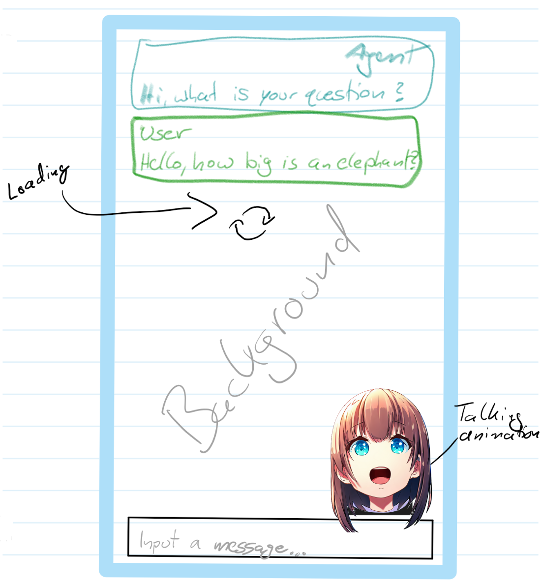

# UIST Exercise 5

## Creating a 2D chat agent

In this exercise you will be tasked to create a chat app where the user can chat with an AI animated 2D agent. You will learn to use the Unity UI system and create simple 2D animations. You will also learn how to run inference on simple pre-trained LLMs and display the results in the UI.

### Preparation

- Clone this Unity project using `git clone`
- Open the project using Unity version `2019.4.**` (Tested with `2019.4.37f1`)
- Open the scene `Assets/Scenes/AgentChat.unity`
- Download `ggml-mpt-7b-chat.bin` from Moodle or the link and place it in `Assets\StreamingAssets\Gpt4All` Link: <https://gpt4all.io/models/ggml-mpt-7b-chat.bin> (Around 4.8 GB)
  - To make sure the model is downloaded, run the scene once and check the console for:
    - `Trying to load LLM model from [...]/Assets/StreamingAssets\Gpt4All/ggml-mpt-7b-chat.bin...`
    - `LLM model is loaded, total time: ... ms`
    - Note: It might take a while to load the model (> 10 seconds)
- In Unity, make sure to set the Game aspect ration to `9:16` <https://docs.unity3d.com/Manual/GameView.html>

### Objectives

- Goal is to create a chat app where the user can chat with an AI agent
- The agent should be represented by an animated 2D character
- There should be an indication then the agent is "thinking" (e.g. a loading icon)
- The chat app should follow the design of common chat apps (e.g. WhatsApp, Telegram, etc.) I.e. there should be a **scrollable chat history** with messages in text bubbles, **colored differently** for the user and the agent, and a **text input field** at the bottom.
- The user should be able to send messages by pressing the `Enter` key, then the loading icon should appear while the agent is thinking, and then the agent should respond with a message. While the agent is responding, the agent should be animated (e.g. the character should be talking). *(The provided API will output the agent's response word by word.)*

#### Criteria / Todos

- UI structure/layout (see below) (Does it match the mockup?)
- UI design (see below) (Are sprites used accordingly?)
- Agent thinking indicator or animated loading icon (Does it appear only when the agent is "thinking"?)
- Agent response text bubble (LLM used?)
- Agent response animation (Is the character animated while the agent is responding?)
- User input text bubble
- Text bubble formatting (line breaks, **speaker name**, **user text left aligned, agent text right aligned**)
- Text bubble colors (e.g. user and agent messages have different colors)
- User's not being able to send empty messages, the input field should be cleared after sending a message and disabled while the agent is responding
- No errors or warnings in the Unity console

##### Bonus (optional - can be used to compensate for missing points in other criteria)

- Add an idle animation to the Agent (e.g. blinking)
- The agent should have more than 2 animations (e.g. idle, talking, thinking) (Instead of the indicator, the agent should be animated while thinking, e.g. question marks above the head)
- Give the agent a voice (e.g. playing audio, only while the agent is talking)

### Support

- The Unity documentation is your friend: <https://docs.unity3d.com/2019.4/Documentation/Manual/index.html>
- The GPT4All object in the scene has an `LlmManager` that is already configured to use the `ggml-mpt-7b-chat.bin` model. You can use this object in the provided script to generate text.
- The `Misc` folder contains a loading icon, a background image, and a chat bubble image. You can use these to create the UI. There is also a sprite sheet for the character animation.
- Create at least 2 animations for the character (e.g. idle and talking). Use the proviced sprite sheet for the animations and slice it using the automatic slicing option in Unity. <https://learn.unity.com/tutorial/introduction-to-sprite-animations>
  - Hint: To animate a UI image, you can use the `Image` and add an `Animator` component to it. You can then use the Animation view to animate the `Source Image` property of the `Image` component. <https://docs.unity3d.com/Manual/animeditor-UsingAnimationEditor.html>
- The UI can be structured using the AutoLayout component system provided by Unity <https://docs.unity3d.com/Packages/com.unity.ugui@1.0/manual/UIAutoLayout.html>
  - Look for `Vertical Layout Group`, `Layout Element` and `Content Size Fitter` in the documentation
- The `chat_bubble` sprite is a 9-patch image. This means that the corners of the image are fixed and the rest of the image can be stretched. <https://docs.unity3d.com/Manual/9SliceSprites.html>
- Use TextMeshPro-Text for the text bubbles and TextMeshPro-InputField for the input field. They are already imported in the project.
- The `Canvas` object is configured correctly and does not have to be changed, but it's child objects are not necessarily configured correctly. Feel free to use the components that are already attached to the objects, but you can also remove them, move them and add your own components.
- Also feel free to create your own sprites and animations. Just make sure your final result meets the criteria above.

### What to turn in

**As a group, please upload the following files:**

- The complete "`Asset`" folder **without(!!)** the LLM model (StreamingAssets/Gpt4All/ggml-mpt-7b-chat.bin)

#### General UI Structure example

```txt
Canvas
└───ScrollRect
    └───Viewport
        └───Content
            └───Message (Prefab)
                └───ChatBubble
                    └───ChatText
                └───... (more messages)
                └───Image (Loading Icon)
└─── Agent 
    └─── Mouth (Animation)
└─── InputField
```

#### Mockup of the UI


